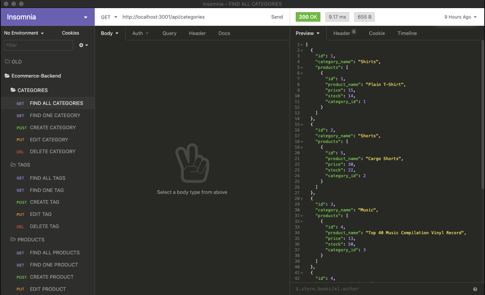

# E-Commerce Backend
  
  
  

  ## Description 

  _Create, search, edit, and delete products from a database using this terminal ran app._
 
  ## Table of Contents

  * [Installation](#installation)
  * [Usage](#usage)
  * [Packages](#packages)
  * [Contributing](#contributing)
  * [Screenshot](#screenshot)
  * [Questions](#questions)
  
  

  ## Installation

  * _Make sure you have cloned the repository files from [here](https://github.com/daejo/ecommerce-backend)._
  * _You will also need an API development environment software [Insomnia](https://insomnia.rest/)._
  * _Once everything is set up you can continue the rest of the installation process._
    * _Open terminal and get to the specific root file where your saved clone file is._
      * _Run mysql by typing: ```mysql -u root -p```_
      * _You will be prompted to add your password_
      * _Type: ```source db/schema.sql``` then ```exit```_
      * _Once you exit mysql type: ```npm run seed```_
      * _Then type: ```npm start```_

  * _After running the installation process keep your terminal running and then open your preferred API development environment._


  ## Usage 

  * Add a new request. Click the (```+```) button and create a new request.
  * To search for an info into the database for:
    * TO SHOW ALL: Select ```GET``` then paste ```http://localhost:3001/api/(EDIT THIS)/``` into the search bar then click ```Send```. [VIDEO](https://drive.google.com/file/d/1qFiViR03ctoPUptb8DWz2bcgzocdGFoQ/view)
      * ```(EDIT THIS)``` could be either ```categories```, ```tags```, or ```products```. 

    * TO SHOW ONE: Select ```GET``` then paste ```http://localhost:3001/api/(EDIT THIS)/(ID HERE)``` into the search bar then click ```Send```. [VIDEO](https://drive.google.com/file/d/1VLITeq1Bs6UtUJhGfG_0dERtdjoR-f7Q/view)
      * ```(ID HERE)``` is equal to a specific ```ID```. 
    
    * TO CREATE ONE: Select ```POST``` then paste ```http://localhost:3001/api/(EDIT THIS)/``` into the search bar then
    change ```BODY``` into ```JSON``` then type in the info you are adding then click ```Send```. [VIDEO](https://drive.google.com/file/d/1xiNw4V9DCGildlFypkWP1Bm92NWC935p/view)

    * TO EDIT ONE: Select ```PUT``` then paste ```http://localhost:3001/api/(EDIT THIS)/(ID HERE)``` into the search bar then
    change ```BODY``` into ```JSON``` then type in the info you are adding then click ```Send```. [VIDEO](https://drive.google.com/file/d/1IMl2ovPqDL9V4yNqxGk4WoHKzTJnUUQp/view)

    * TO DELETE ONE: Select ```DELETE``` then paste ```http://localhost:3001/api/(EDIT THIS)/(ID HERE)``` into the search bar then click ```Send```. [VIDEO](https://drive.google.com/file/d/1f3-8ool1d07oOGhFRew_UFFkEqbzNDBA/view)

  * [FULL WALKTHROUGH VIDEO](https://drive.google.com/file/d/1MUgSH1QN1HMBYRWDmM6XrjyGRhj8SJsV/view)

  ## Packages
    dotenv
    express
    mysql2
    sequelize


  ## Contributing

  _Free to use, clone and edit_


  ## Screenshot

  


  ---
  ## Questions?
  _Contact me:_
  _[@daejo](https://github.com/daejo)_  
  _[https://github.com/daejo/ecommerce-backend](https://github.com/daejo/ecommerce-backend)_  
  
